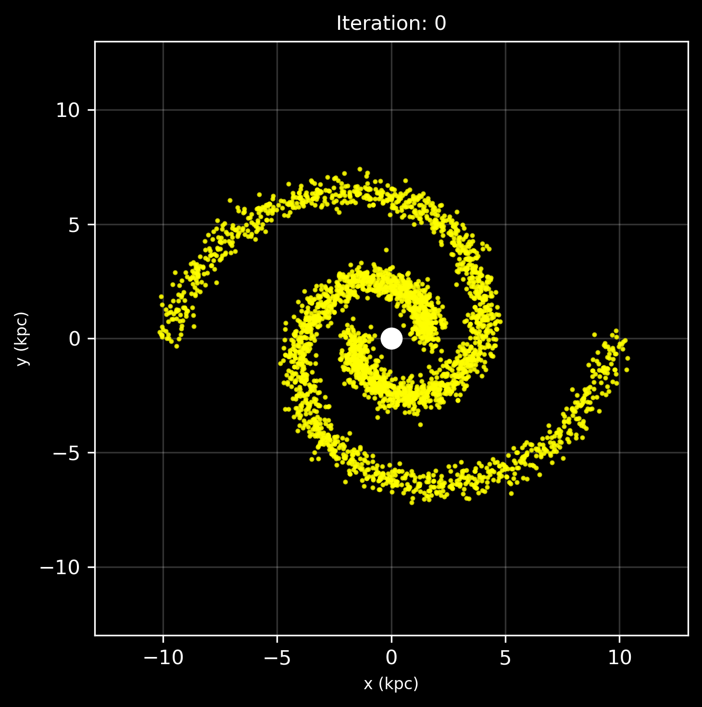
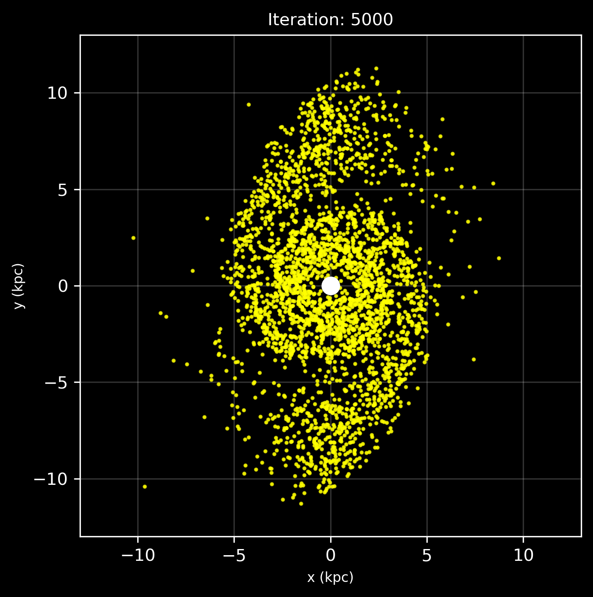
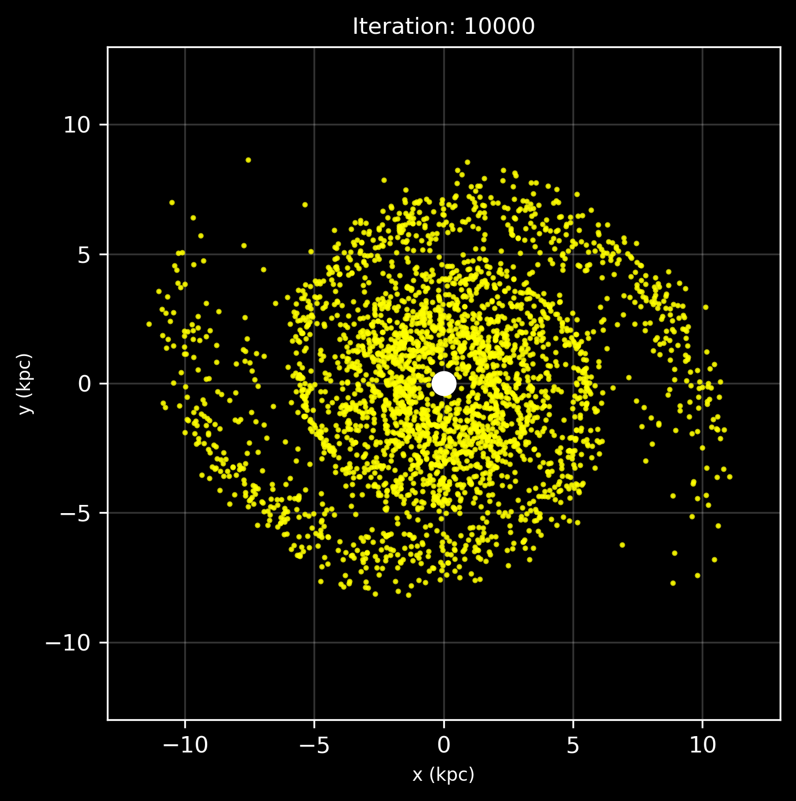
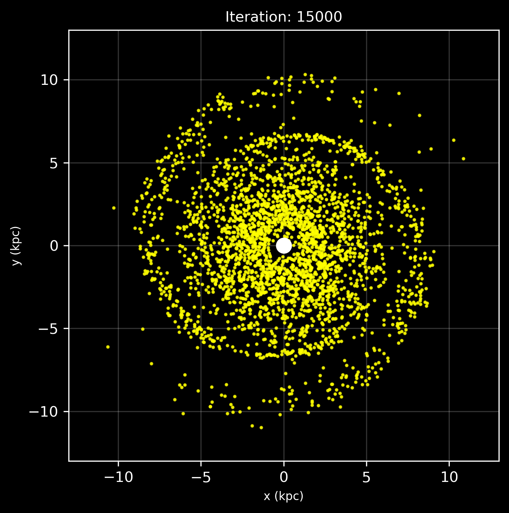
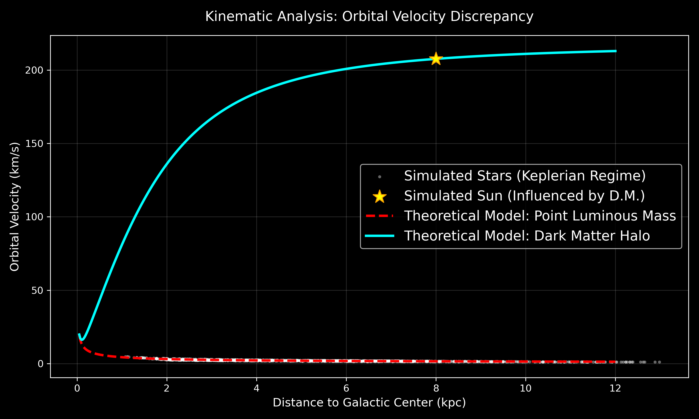
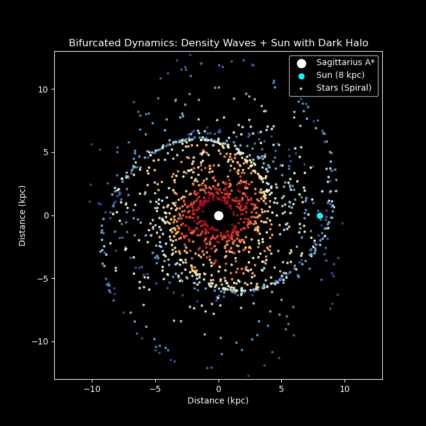

# Galactic_Dynamics_Simulation
Computational N-body simulation of spiral galaxies using Velocity Verlet. Explores the Winding Problem, Lin-Shu Density Wave Theory, and Dark Matter halos to replicate solar orbital periods.

## What is this project?

If you only apply standard Keplerian gravity, galactic dynamics don't make much sense. This project models a galaxy step-by-step to show:
1. Why differential rotation destroys static spiral arms (**The Winding Problem**).
2. How density waves fix the shape of the galaxy (**Lin-Shu Theory**).
3. Why we need Dark Matter to fix the math behind orbital speeds.

---

## Simulation Phases

### 1. The Winding Problem
If spiral arms were made of fixed stars, the inner stars would orbit much faster than the outer ones. This first simulation shows how differential rotation quickly shreds the spiral shape, proving that galactic arms aren't solid, rigid structures.

| Initial State | Kinematic Shearing |
| :---: | :---: |
|  |  |
| **Advanced Shearing** | **Final Homogenized State** |
|  |  |

### 2. Lin-Shu Density Waves
To keep the spiral shape stable, I implemented the Lin-Shu Density Wave Theory. Instead of circular orbits, stars follow synchronized elliptical paths with a progressive phase shift. This creates a kinematic "traffic jam"—the spiral pattern stays put while individual stars continuously move in and out of it.


### 3. Adding the Dark Matter Halo
The density wave model looks great visually, but the math falls short. If we only count the visible mass (Sagittarius A*), our simulated Sun takes way too long to complete an orbit. 

By adding a Dark Matter halo (a distributed mass model), the orbital velocities stop decaying and flatten out. This extra gravitational pull speeds up the outer stars, adjusting the simulated solar period to the real empirical value of ~230 million years.




---

## Tech Stack
* **Python 3**
* **NumPy:** Used for matrix operations and vectorizing the gravitational calculations.
* **Matplotlib:** For rendering the scatter plots and generating the animations.

## How to Run
1. Clone this repository:
   ```bash
   git clone [https://github.com/javiergarciapaez-blip/Galactic_Dynamics_Simulation.git](https://github.com/javiergarciapaez-blip/Galactic_Dynamics_Simulation.git)

2.Install the required dependencies using the requirements file:
  ```bash
  pip install -r requirements.txt
